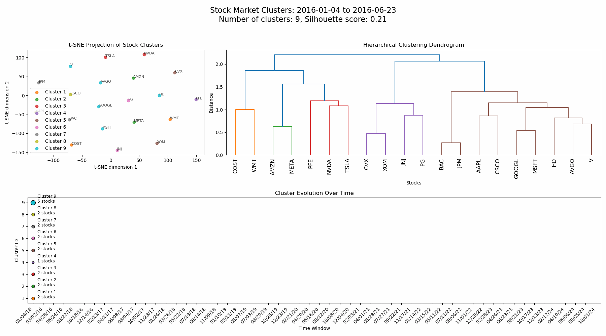

# Temporal Hierarchical Clustering

A Python tool for analyzing and visualizing the evolving relationships between financial instruments over time.


## Overview

This project implements a temporal hierarchical clustering approach to financial market analysis. It tracks how relationships between stocks and ETFs evolve over time, revealing shifting correlations and sector dynamics.

Key features:

- Hierarchical clustering of financial instruments based on price correlations and features
- Temporal tracking of clusters across multiple time windows
- Visualization of cluster evolution through interactive animations
- Support for multiple clustering metrics (Davies-Bouldin Index, Silhouette, Calinski-Harabasz)
- Support for different linkage methods (Average, Ward, Complete, Single)

## Example Animations

### Standard Silhouette-based Clustering



### Davies-Bouldin with Average Linkage (Recommended)


## Installation

```bash
# Clone the repository
git clone https://github.com/yourusername/Temporal-Hierarchical-Clustering.git
cd Temporal-Hierarchical-Clustering

# Create conda environment
conda create -n clustering python=3.9
conda activate clustering

# Install dependencies
pip install numpy pandas matplotlib scipy scikit-learn yfinance networkx
```

## Usage

```bash
python main.py [options]
```

### Command-line Options

| Option             | Description                                                                      | Default                       |
| ------------------ | -------------------------------------------------------------------------------- | ----------------------------- |
| `--tickers`      | Number of tickers to analyze                                                     | 10                            |
| `--start`        | Start date (YYYY-MM-DD)                                                          | 2022-01-01                    |
| `--end`          | End date (YYYY-MM-DD)                                                            | 2022-12-31                    |
| `--window`       | Size of time window in days                                                      | 60                            |
| `--step`         | Step size between windows in days                                                | 30                            |
| `--output`       | Output filename                                                                  | market_clusters_animation.mp4 |
| `--max-clusters` | Maximum number of clusters to consider (use -1 for auto)                         | 8                             |
| `--show-scores`  | Show quality scores for all cluster counts                                       | False                         |
| `--metric`       | Clustering quality metric to use (silhouette, davies_bouldin, calinski_harabasz) | davies_bouldin                |
| `--linkage`      | Linkage method (ward, average, complete, single)                                 | average                       |

### Examples

#### Fine-grained Analysis with Davies-Bouldin and Average Linkage (Recommended)

```bash
python main.py --tickers 50 --max-clusters -1 --show-scores --start 2016-01-01 --end 2025-03-28 --window 120 --step 60 --metric davies_bouldin --linkage average
```

#### Traditional Analysis with Silhouette Score and Ward Linkage

```bash
python main.py --tickers 30 --max-clusters 10 --show-scores --metric silhouette --linkage ward
```

## Methodology

The analysis works through the following steps:

1. **Data Collection**: Financial time series data is downloaded for the specified tickers
2. **Feature Extraction**: Statistical features are calculated for each instrument in each time window
3. **Clustering**: Hierarchical clustering is performed based on correlation distances
4. **Temporal Tracking**: Clusters are tracked across time windows using the Hungarian algorithm
5. **Visualization**: Interactive animations show the evolution of clusters over time

## Interpretation

The visualizations provide several insights:

- **Dendrogram**: Shows hierarchical relationships between instruments
- **t-SNE Projection**: Provides a 2D representation of correlations
- **Flow Diagram**: Tracks cluster evolution over time

When instruments cluster together persistently across time windows, it suggests they may be driven by similar underlying factors.

## Advanced Options

### Clustering Metrics

- **Davies-Bouldin Index** (recommended): Evaluates the average similarity between clusters, with lower values indicating better clustering
- **Silhouette Score**: Measures how similar objects are to their own cluster compared to other clusters
- **Calinski-Harabasz Index**: Ratio of between-cluster to within-cluster variance

### Linkage Methods

- **Average** (recommended): Uses the average distance between all pairs of objects, robust for financial data
- **Ward**: Minimizes variance within clusters, tends to create equal-sized clusters
- **Complete**: Uses the maximum distance between objects, creates more compact clusters
- **Single**: Uses the minimum distance between objects, can detect non-elliptical shapes

## License

This project is licensed under the MIT License - see the LICENSE file for details.
